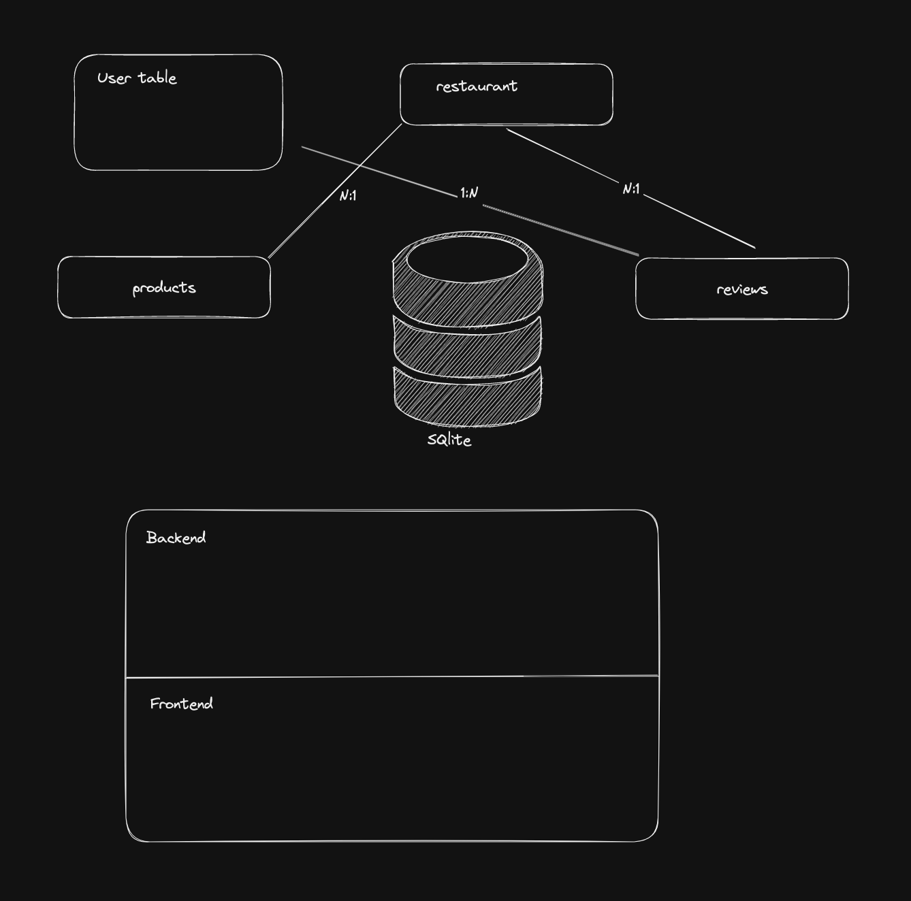
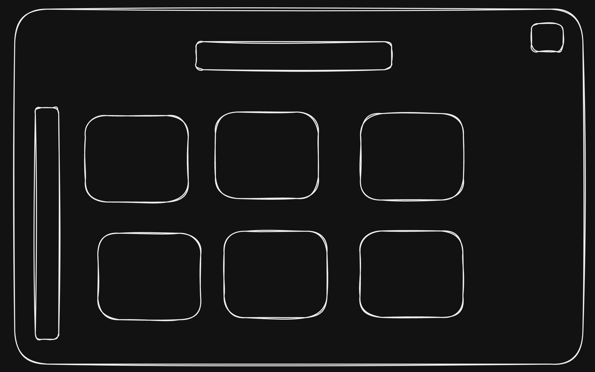
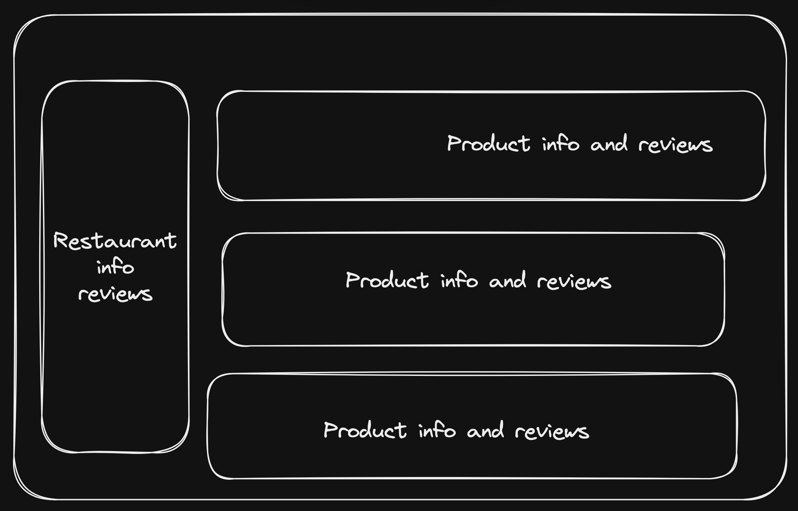

# Introduction
- Hi, I'm João Reberti and first of all let me say I had a lot of fun developing this app. 🥳
- This fullstack app was made possible via [Remix's Indie Stack](./Remix-README.md)
- The app is reachable at https://smunch-e712.fly.dev/
  - Fly was already implemented and setting it up was a breeze. Plus it was free host and database (which is nothing more than a file but I digress).
- Just register a new account and have fun finding any bugs 🐞

## Goal

- The goal of this project is to showcase how remix can be used in a production fashion to enable a fullstack application
- Also, using cyprus, for e2e, and vitest, for unit tests, allowed me to follow a quasi-tdd approach, not full fledged since it was my first time using Remix, which involved a lot of exploration and solidifying the mental model behind loaders, actions, SSR and the normal CSR of react.
- stack:
  - Typescript;
  - Remix;
  - Tailwind
  - Cyprus
  - Vitest
  - Prisma
  - SQLite
  - Fly
  - Github actions

## Features

- This a simple fullstack app that allows users to:
  - Register, login and logout (even though no authentication is implemented),
  - View a list of restaurants, with some information like average rating and latest review
  - View a list of restaurants filtered by cuisine
  - View the products belonging to a giver restaurant, along with their average rating and latest reviews
  - Add reviews, with comment and rating, to a restaurant
  - Add reviews, with comment and rating, to a product
  - Visualise a timeline of latest reviews which link to the product or restaurant related to the review

## Next steps

I've identified several bottlenecks in the current implementation.

- Average rating
  - the more reviews a restaurant or product has the longer it will take for the server to compute the average rating
  - This could be solved via caching after first computation and some logic to invalidate the cache of a given review upon creation of a new review.
- Using the same database for e2e and production
  - This forced me to create an endpoint `/reset-db` to be able to reset the database on request.
  - Alternatively I could have created a separate test database.
  - Also could have added a seed script to run based on a given environment variable
  - Or I could have added the create restaurant and product to the e2e tests, and in that way start from fresh on each iteration.
- Prisma
  - This ORM has been subject to a lot of critique lately due to it's perceived slowness. Perhaps a query builder would be enough for this use case. Nonetheless, the schema syncing based on models and the ability to take care of all the relations proved to be a plus for my developer experience. I would search for an alternative if it did indeed become a bottleneck.

As the project complexity grows, I would create separate folders all business logic in the controllers (*loaders* and *actions*) into separate files. 

### Other

#### Initial architecture draft

#### Initial restaurant list UI

#### Initial restaurant detail UI

